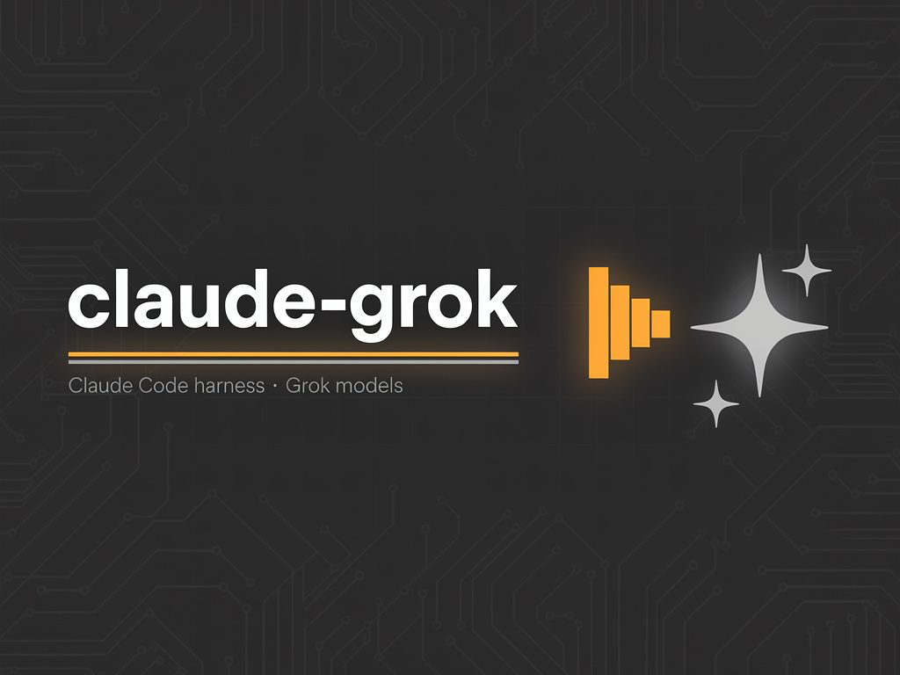
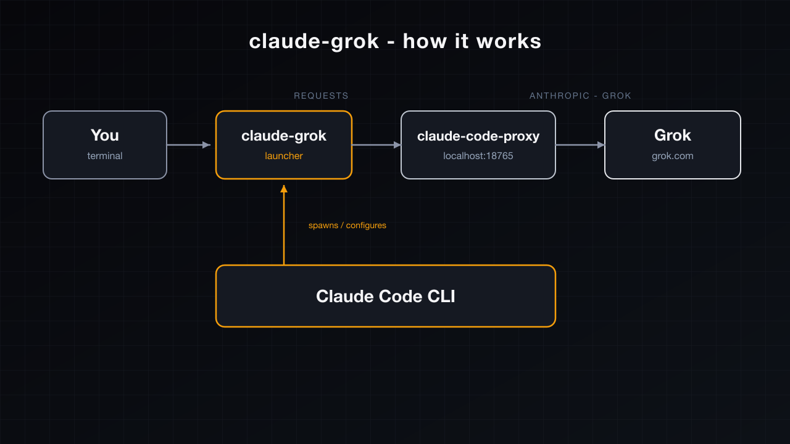

# claude-grok

<p align="center">
  
</p>

**Run [Claude Code](https://docs.anthropic.com/en/docs/claude-code) on Grok.**

A thin launcher that points Claude Code at a local Anthropic-compatible proxy backed by your **grok.com** subscription (`grok-4.5` / `grok-composer-2.5-fast`).

## How it works

<p align="center">
  
</p>

1. `claude-grok` starts (or reuses) [`claude-code-proxy`](https://github.com/raine/claude-code-proxy) on `127.0.0.1:18765`
2. Starts a tiny sanitize bridge on `127.0.0.1:18766` in front of the proxy
3. Sets `ANTHROPIC_BASE_URL` + model env vars so Claude Code speaks Anthropic `/v1/messages`
4. The proxy translates those calls to Grok’s Responses API using your grok.com OAuth session

Claude Code stays the harness (tools, skills, hooks, MCP). Grok is the model.

### Why the bridge?

Claude Code `Read(png/jpg/...)` returns `tool_result` children with `"type":"image"`.
Current `claude-code-proxy` (≤0.1.25) hard-fails those on the Grok path with:

```text
API Error: 400 tool result supports text children only
```

`claude-grok-bridge` rewrites those image children to text placeholders
(`[image omitted: image/png]`) before the request hits the proxy — same L1
behavior as upstream [PR #69](https://github.com/raine/claude-code-proxy/pull/69).
When that PR ships in a release, you can set `CLAUDE_GROK_DISABLE_BRIDGE=1`.

## Install

```bash
git clone https://github.com/DevvGwardo/claude-grok.git
cd claude-grok
./install.sh
```

### Prerequisites

```bash
# 1) Claude Code CLI
# https://docs.anthropic.com/en/docs/claude-code

# 2) Local Anthropic↔Grok proxy
brew install raine/claude-code-proxy/claude-code-proxy
claude-code-proxy grok auth login
brew services start raine/claude-code-proxy/claude-code-proxy
```

## Usage

```bash
claude-grok                          # grok-4.5 (default)
claude-grok grok-composer-2.5-fast
claude-grok models
claude-grok -p "say hi"
```

Optional env knobs:

| Var | Default | Meaning |
|-----|---------|---------|
| `CLAUDE_GROK_MODEL` | `grok-4.5` | Default model |
| `CLAUDE_GROK_BASE_URL` | `http://127.0.0.1:18766` | Bridge URL Claude Code hits |
| `CLAUDE_GROK_UPSTREAM` | `http://127.0.0.1:18765` | Real `claude-code-proxy` URL |
| `CLAUDE_GROK_PROXY_BIN` | `claude-code-proxy` on `PATH` | Proxy binary |
| `CLAUDE_GROK_DISABLE_BRIDGE` | `0` | Set `1` to skip sanitize bridge |

## Models

Registered Grok ids (via the proxy):

- `grok-4.5`
- `grok-composer-2.5-fast`

```bash
claude-code-proxy models
claude-code-proxy grok auth status
```

## Notes / limits

- Auth is **owned by the proxy** (`~/.config/claude-code-proxy/grok/`). It does **not** reuse `~/.grok/auth.json`.
- The proxy binds to loopback and accepts unauthenticated local clients — keep it on `127.0.0.1`.
- Unofficial subscription clients may carry account / ToS risk. Use at your own risk.
- Image / multimodal through this path is limited: the bridge **omits** image bytes (text placeholder) so the session stays alive. Full Grok vision for tool images needs [PR #69](https://github.com/raine/claude-code-proxy/pull/69) `CCP_GROK_TOOL_IMAGE`.
- This repo is a launcher + sanitize bridge + docs. Upstream protocol work lives in [raine/claude-code-proxy](https://github.com/raine/claude-code-proxy).

## Related

- [claude-code-proxy](https://github.com/raine/claude-code-proxy) — Anthropic-shaped local proxy (Codex / Kimi / Grok / Cursor)
- [Claude Code](https://docs.anthropic.com/en/docs/claude-code)
- [Grok](https://grok.com)

## License

MIT
